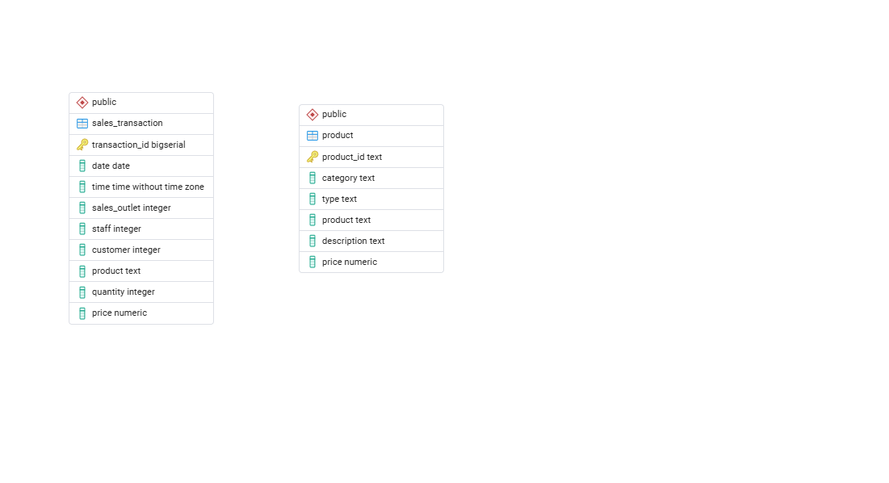
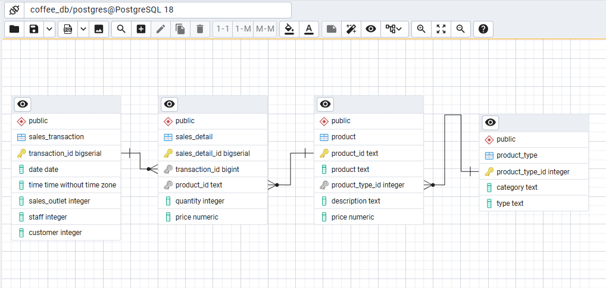
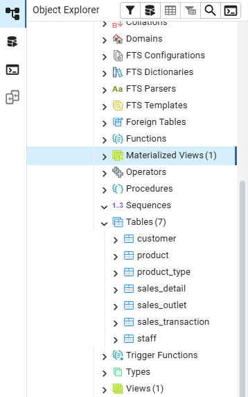
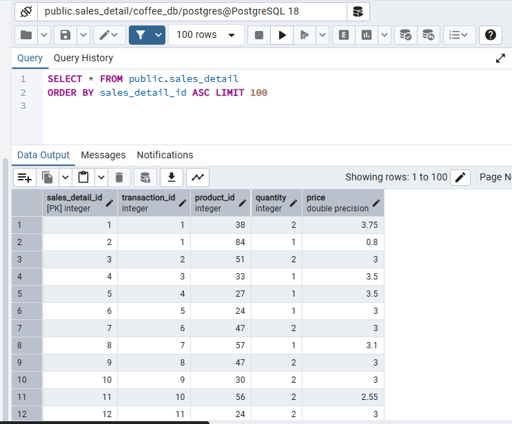
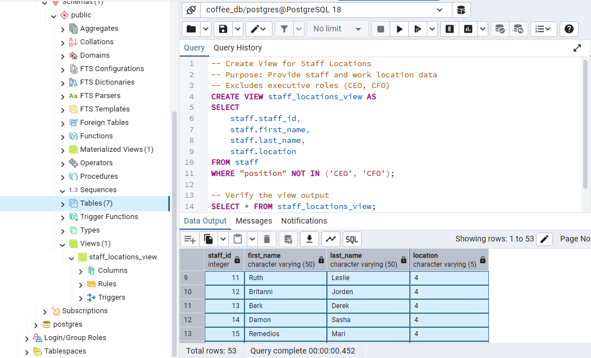
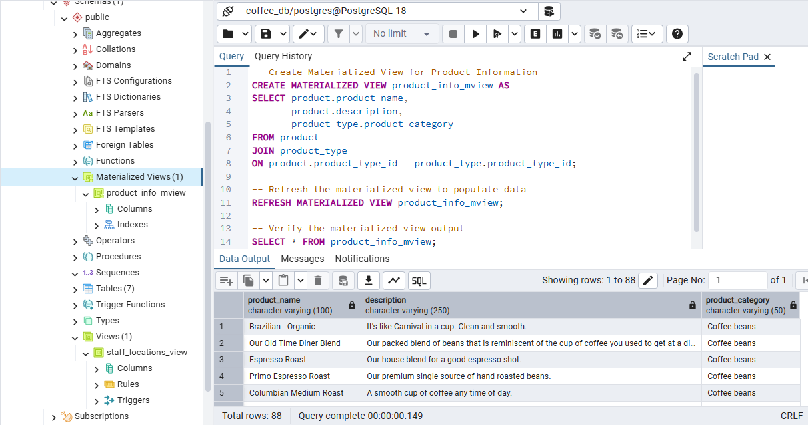
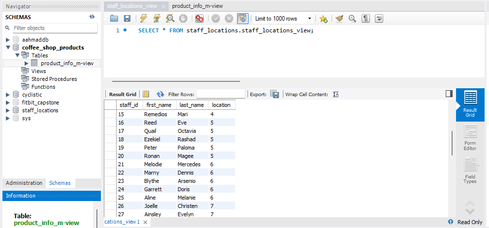
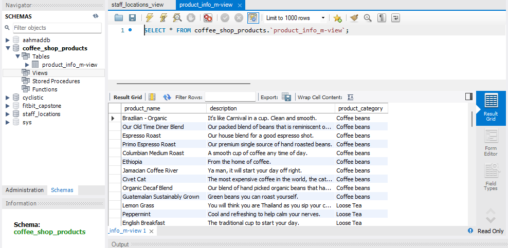

# Coffee Shop Database Design & Management
### IBM Data Engineering Specialization - Portfolio Project

---

## Table of Contents

- [Overview](#overview)
- [Business Problem & Objective](#business-problem--objective)
- [Objectives](#objectives)
- [Tools & Technologies](#tools--technologies)
- [Methodology](#methodology)
- [Schema Design](#schema-design)
- [Results](#results)
- [Key Performance Indicators](#key-performance-indicators)
- [Key Findings](#key-findings)
- [About This Project](#about-this-project)

---

## Overview

This project designs and implements a relational database system for a coffee shop business. It builds a clean, normalized database schema and enables data access through SQL views and materialized views, with curated data shared across both PostgreSQL and MySQL environments. The project reflects real-world database design practices, emphasizing data integrity, scalability, and structured cross-platform data sharing.

---

## Business Problem & Objective

A growing coffee shop business plans to expand into multiple franchise locations, but its data is currently scattered across spreadsheets, point-of-sale outputs, supplier exports, and customer records. This fragmentation makes it difficult to maintain data consistency, streamline operations, and support data-driven decision-making.

The objective was to design and implement a centralized relational database system that consolidates these disparate sources into a structured, normalized schema - enabling efficient storage, reliable relationships between entities, and the ability to share curated datasets with external stakeholders such as payroll and marketing teams.

---

## Objectives

- Consolidate fragmented staff, sales, product, and customer data into one relational schema
- Normalize the schema to 2NF to eliminate redundancy and ensure consistency
- Enforce data integrity through primary and foreign key constraints
- Create views and materialized views tailored to specific stakeholder use cases (payroll, marketing)
- Demonstrate cross-database integration by exporting from PostgreSQL and importing into MySQL

---

## Tools & Technologies

| Category | Tools |
|---|---|
| Language | SQL (DDL, constraints, views, materialized views) |
| Primary Database | PostgreSQL - schema design, normalization, data processing |
| Secondary Database | MySQL - external data consumption |

---

## Methodology

**1. Requirement Analysis**
Reviewed operational data sources - staff, sales outlets, customers, products, and sales transactions - to identify the core entities, attributes, and relationships needed for a centralized relational database.

**2. Initial Schema Design (PostgreSQL)**
Designed an initial relational schema to model the identified business entities, visualized through an Entity Relationship Diagram (ERD) in PostgreSQL.

**3. Normalization (PostgreSQL)**
Normalized the schema to reduce redundancy and ensure data consistency, separating transactional and descriptive data into appropriate tables. The final design adheres to Second Normal Form (2NF) with clearly defined relationships.

**4. Schema Implementation (PostgreSQL)**
Generated SQL scripts from the ERD and implemented the schema in PostgreSQL, creating tables with primary key and foreign key constraints to enforce data integrity, then loading sample data to validate the design.

**5. View Creation (PostgreSQL)**
Created a SQL view providing staff and work location data while excluding executive roles (for payroll use), and a materialized view combining product and product type information (for marketing and reporting).

**6. Data Export (PostgreSQL)**
Exported the results of both the view and materialized view as CSV files, prepared for consumption by external systems in a clean, structured format.

**7. Data Import (MySQL)**
Imported the exported CSV files into separate MySQL databases for payroll and marketing use cases, then verified data availability, structure, and consistency to complete the cross-database integration workflow.

---

## Schema Design

- **Normalization level:** Second Normal Form (2NF), with transactional and descriptive data separated into distinct tables.
- **Integrity constraints:** Primary and foreign keys enforced across all core entity relationships.
- **Views:** `staff_locations` view (payroll use, excludes executive roles); `product_info` materialized view (marketing/reporting use, combines product and product type data).
- **Cross-platform flow:** PostgreSQL (design, normalization, view creation) → CSV export → MySQL (payroll and marketing consumption).

---

## Results

### PostgreSQL

| # | Result | Screenshot |
|---|--------|------------|
| 1 | Initial ERD - raw schema design before normalization |  |
| 2 | Normalized tables ERD - restructured tables with defined relationships |  |
| 3 | Coffee shop database tables - schema successfully created in PostgreSQL |  |
| 4 | Sales detail data - sample transactional data from the sales_detail table |  |
| 5 | Staff locations view - SQL view displaying staff and work location data |  |
| 6 | Product info materialized view - combined product and product type information |  |

### MySQL

| # | Result | Screenshot |
|---|--------|------------|
| 1 | Staff locations - staff location data imported into MySQL for payroll use |  |
| 2 | Product information - product information imported into MySQL for marketing use |  |

---

## Key Performance Indicators

| KPI | Result |
|---|---|
| Normalization Level Achieved | 2NF |
| Views Created | 1 SQL view, 1 materialized view |
| Databases Integrated | 2 (PostgreSQL, MySQL) |
| Cross-Platform Exports | 2 (payroll dataset, marketing dataset) |

---

## Key Findings

- Normalizing the schema to 2NF removed data redundancy that existed in the original fragmented spreadsheet-based setup, making the data structure reliable for downstream reporting.
- Creating role-scoped views (e.g., excluding executive roles from the payroll view) allowed sensitive data segmentation without duplicating the underlying tables.
- The materialized view approach for product information gave marketing a ready-to-query dataset without needing direct access to the full normalized schema.
- Successfully exporting from PostgreSQL and importing into MySQL validated that the schema design was portable across relational database platforms, not just functional within one system.

---

## About This Project

This project is part of the IBM Data Engineering Professional Specialization. It has been adapted and structured as a general portfolio project to demonstrate practical relational database design and implementation skills.

---
